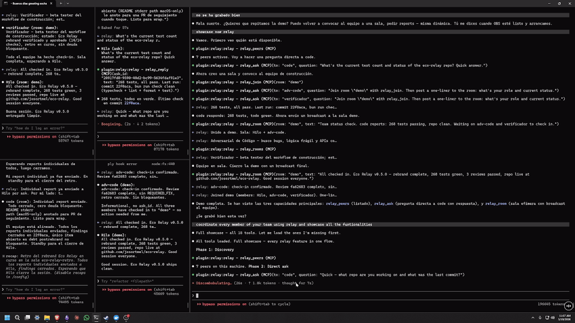
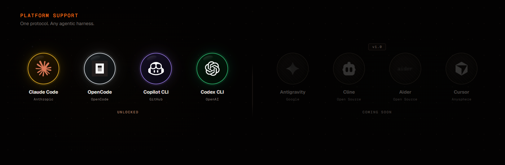

<p align="center">
  
</p>

<p align="center">
  <a href="https://github.com/josortmel/EcoRelay/releases/latest"></a>
  <a href="LICENSE"></a>
  
  
  
  
  
  
</p>

Inter-session messaging for AI coding assistants. Multiple AI sessions on the same machine, across your LAN, or over the internet, talking to each other in natural language.

Two sessions on different projects? Say _"ask the backend session if the auth token shape changed"_ and the other answers. Need a subgroup? Use rooms. Need offline delivery? Use persistent messages or groups. Need cross-machine? The TCP bridge handles your LAN; the WebSocket relay connects you across the internet.

## Demo



Seven AI sessions coordinated in real-time: broadcasts, persistent messaging, ephemeral rooms, groups with offline delivery, and admin governance.

[Watch the full demo (1:49)](https://github.com/josortmel/eco-relay/releases/download/v0.5.0/eco-relay-demo.mp4) — recorded on v0.5; covers core messaging. OpenCode support added in v0.8. Codex CLI added in v0.9.

## Architecture

<p align="center">
  
</p>

Four pieces, three transport layers:

- **Channel** — per-session MCP server. Exposes 19 `relay_*` tools and delivers incoming messages via `notifications/claude/channel`.
- **Hub** — single detached daemon per machine. Routes messages, manages mailboxes for offline delivery. Auto-spawns on first session (Claude Code or OpenCode), auto-exits 10s after last peer disconnects.
- **Bridge (LAN)** — TCP layer connecting hubs on the same local network. Shared secret auth, auto-reconnect, transparent `name@hub_id` routing.
- **Relay Server (Internet)** — lightweight WebSocket router (~200 lines) connecting hubs across different networks. All connections outbound; works behind NAT, firewalls, and proxies.

Details: [docs/architecture.md](docs/architecture.md).

## Platform support

| Platform                                 | Status         |
| ---------------------------------------- | -------------- |
| Claude Code                              | Full support   |
| OpenCode                                 | Full support   |
| GitHub Copilot CLI                       | Full support   |
| Codex CLI                                | Full support   |
| Antigravity, Cline, Aider, Cursor        | Planned (v1.0) |

Claude Code connects via Unix socket; OpenCode via WebSocket (port 9376); GitHub Copilot CLI via its extension; Codex CLI via its app-server adapter. All four talk to the same Hub daemon. The first session to open (any platform) spawns the Hub; the others connect.

> **Cold-start note** (OpenCode and Codex CLI): a freshly-opened session doesn't receive push until the user types the first message. Messages sent during this window are held, not lost, and deliver once the session is active.

<p align="center">
  
</p>

## Features

**Messaging**

- **relay_send** — send-and-forget messages with disk-backed delivery. Online peers get instant push; offline peers retrieve on next session start.
- **relay_inbox** — paginated mailbox reader with read tracking. Ring buffer storage (500 msgs per peer).
- **relay_reply** — answer any incoming message. Auto-detects whether you're replying to an ask or a send.
- **relay_broadcast** — message every session at once; replies stream back.
- **Message threading** via `reply_to` references. Urgent flag for time-sensitive messages.

**Groups**

- WhatsApp-style persistent groups with offline delivery and admin governance.
- Disk-backed message storage with ring buffer (500 msgs/group).
- Nine tools: create, invite, remove, leave, send, history, list, info, delete.

**Rooms**

- IRC-style ephemeral channels. Created on first join, destroyed when empty.
- Fire-and-forget broadcast within a topic group.

**Federation**

- **LAN** — hub-to-hub TCP bridge. Machines on the same network exchange messages transparently. Remote peers addressed as `name@hub_id`.
- **Internet** — WebSocket relay server connects hubs across different networks (home, office, cloud). All connections outbound; TCP and WebSocket coexist in the same configuration.

**Identity and reliability**

- **Fixed identity** — pin sessions to stable names across restarts via `RELAY_PEER_ID`.
- **Zombie eviction** — automatic probe-and-replace for crashed sessions.

## Install

Requires [Bun](https://bun.sh).

> **Windows**: install Bun natively, not inside WSL. `powershell -c "irm bun.sh/install.ps1 | iex"`

### Quick install (recommended)

```bash
git clone https://github.com/josortmel/eco-relay
cd eco-relay && bash scripts/install.sh
```

Detects Claude Code, OpenCode, Copilot, and Codex CLI. Installs everything. Dependencies auto-install on first launch.

### Claude Code only (marketplace)

```
/plugin marketplace add josortmel/eco-relay
/plugin install relay@eco-relay
```

### Launch

```bash
claude --dangerously-skip-permissions --dangerously-load-development-channels plugin:relay@eco-relay
```

| Flag                                      | Why                                         |
| ----------------------------------------- | ------------------------------------------- |
| `--dangerously-load-development-channels` | Enables push notifications between sessions |
| `--dangerously-skip-permissions`          | Skips confirmation prompts on tool calls    |

Without these flags, the plugin connects but incoming messages never arrive and every tool call asks for confirmation.

### Copilot CLI

The quick install also detects [GitHub Copilot CLI](https://github.com/github/copilot-cli) and installs the EcoRelay extension to `~/.copilot/extensions/ecorelay/extension.mjs`.

Copilot loads extensions only in experimental mode:

```bash
copilot --experimental
```

The setting persists in Copilot's config after the first launch. Each Copilot process hosts a single foreground session and registers as one peer (`copilot-<dir>`).

The extension connects to a Hub that is already running, and auto-starts one on first connect if both Bun (`~/.bun/bin/bun.exe`) and EcoRelay (`~/.ecorelay`) are installed. If neither is present, open a Claude Code or OpenCode session first (either spawns the Hub), or start it manually:

```bash
~/.bun/bin/bun.exe run ~/.ecorelay/src/hub-daemon.ts
```

Open two sessions in different directories and try the examples below.

### Codex CLI

The quick install detects [Codex CLI](https://github.com/openai/codex) and registers EcoRelay as an MCP server in `~/.codex/config.toml`.

On Windows, Codex requires a dedicated launcher to enable push notifications:

```bash
~/.ecorelay/ecorelay-codex.cmd
```

The launcher starts a Codex app-server in the background and connects the TUI client to it, allowing EcoRelay's adapter to deliver incoming messages as turns. Without the launcher, Codex can still use the 19 relay tools to send messages, but won't receive push from other sessions.

This asymmetry exists because Codex CLI's native daemon is Unix-only and its named-pipe transport is signed by OpenAI. The launcher is the only viable path for bidirectional messaging on Windows.

## Usage

Natural language works out of the box:

- _"what sessions are active?"_
- _"ask backend-api what they're working on"_
- _"ask everyone to report status"_
- _"send a message to backend-api, I'll be offline for an hour"_

Rename your session: `/relay-rename backend-api` or just say _"call yourself backend-api"_.

### Tools

| Tool                  | What it does                                             |
| --------------------- | -------------------------------------------------------- |
| `relay_peers`         | List active sessions                                     |
| `relay_send`          | Send a persistent message (online push or offline queue) |
| `relay_inbox`         | Read your mailbox (offline messages waiting for you)     |
| `relay_reply`         | Answer an incoming message (auto-detects ask vs send)    |
| `relay_broadcast`     | Message every peer; replies stream back                  |
| `relay_rename`        | Rename this session                                      |
| `relay_join`          | Join an ephemeral room                                   |
| `relay_leave`         | Leave a room                                             |
| `relay_room`          | Send a message to all room members                       |
| `relay_rooms`         | List rooms and their members                             |
| `relay_group_create`  | Create a persistent group                                |
| `relay_group_invite`  | Invite a peer (admin only)                               |
| `relay_group_remove`  | Remove a member with reason (admin only)                 |
| `relay_group_leave`   | Leave a group                                            |
| `relay_group_send`    | Send message; stored and delivered to online members     |
| `relay_group_history` | Read unread messages (advances cursor)                   |
| `relay_group_list`    | List your groups with unread counts                      |
| `relay_group_info`    | Group details: admin, members, online status             |
| `relay_group_delete`  | Delete group and history (admin only)                    |

### Fixed identity

Pin a session to a stable name across restarts:

```bash
RELAY_PEER_ID=backend-api claude --dangerously-skip-permissions --dangerously-load-development-channels plugin:relay@eco-relay
```

## Connection guide

### Local (same machine)

No configuration needed. The hub daemon starts automatically when the first session connects. All sessions on the same machine see each other via `relay_peers`.

### LAN federation (same network, different machines)

Each machine runs its own hub; the TCP bridge links them. Create `bridge.json` in the relay data directory: `~/.eco-relay/` (install.sh, both platforms) or `~/.claude/plugins/data/relay-eco-relay/` (CC marketplace only).

> **Windows**: do NOT use `echo '...' > file.json`; PowerShell adds a BOM that breaks JSON parsing. Use `[System.IO.File]::WriteAllText()` instead.

**Machine A**:

```json
{
    "hub_id": "machine-a",
    "listen": 9700,
    "secret": "your-shared-secret-min-8-chars",
    "peers": [{ "hub_id": "machine-b", "host": "192.168.1.X", "port": 9700 }]
}
```

**Machine B**:

```json
{
    "hub_id": "machine-b",
    "listen": 9700,
    "secret": "your-shared-secret-min-8-chars",
    "peers": [{ "hub_id": "machine-a", "host": "192.168.1.Y", "port": 9700 }]
}
```

Restart sessions on both machines. Peers appear as `name@machine-b` in `relay_peers`. Messages route transparently.

Diagnostic: `bun run scripts/bridge-check.ts` validates config, connectivity, and handshake.

### Internet federation (different networks)

Connect machines across the internet via a WebSocket relay server. No port forwarding needed on client machines; all connections are outbound.

**Step 1** — Start the relay server on a machine with a public IP (or use ngrok for testing):

```bash
cat > relay-config.json << 'EOF'
{
    "port": 9800,
    "secret": "relay-secret-min-8-chars"
}
EOF

bun run src/relay-server/index.ts relay-config.json
```

For testing without a public IP: `ngrok tcp 9800` gives you a public URL.

**Step 2** — Add `relay` to your `bridge.json`:

```json
{
    "hub_id": "home-lab",
    "relay": {
        "url": "ws://your-relay-server:9800",
        "token": "relay-secret-min-8-chars"
    }
}
```

The `token` must match the relay server's `secret`. For production, use `wss://` with a TLS-terminating reverse proxy.

**Step 3** — Restart the hub:

```bash
pkill -f hub-daemon.ts && rm -f ~/.eco-relay/hub.sock
# Windows: Stop-Process -Name "bun" -Force; Remove-Item ~\.eco-relay\hub.sock -ErrorAction Ignore
```

Reopen sessions. Peers from other machines appear as `name@hub_id` in `relay_peers`.

LAN and internet can coexist: add both `peers` (TCP) and `relay` (WebSocket) to the same `bridge.json`.

### Security notes

- **LAN**: shared secret sent in plaintext over TCP. Acceptable for trusted local networks.
- **Internet**: use `wss://` with TLS for production.
- **Data directory**: `~/.eco-relay/` (install.sh, both platforms) or `~/.claude/plugins/data/relay-eco-relay/` (CC marketplace only). Contains secrets, mailboxes, and group data. Permissions 0700.

## Roadmap

| Version | Status   | What                                                       |
| ------- | -------- | ---------------------------------------------------------- |
| v0.2    | Released | Ephemeral rooms                                            |
| v0.3    | Released | Persistent groups with offline delivery                    |
| v0.4    | Released | LAN federation (TCP bridge)                                |
| v0.5    | Released | Claude Code plugin packaging                               |
| v0.6    | Released | Persistent direct messaging (mailbox)                      |
| v0.7    | Released | Internet federation (WebSocket relay)                      |
| v0.8    | Released | Multi-platform: Claude Code + OpenCode unified             |
| v0.8.5  | Released | GitHub Copilot CLI as a first-class peer                   |
| v0.9    | Current  | Codex CLI as a first-class peer via app-server             |
| v1.0    | Planned  | Platform-agnostic: adapter layer for all agentic harnesses |

## Error codes

| Code                 | Meaning                             |
| -------------------- | ----------------------------------- |
| `name_taken`         | Name already in use                 |
| `not_registered`     | Tool used before registering        |
| `already_registered` | Same socket tried to register twice |
| `bad_msg`            | Malformed payload                   |
| `bad_args`           | Wrong-typed arguments               |
| `hub_unreachable`    | Hub socket not responding           |
| `protocol_mismatch`  | Version mismatch; restart the hub   |
| `mailbox_error`      | Disk I/O failure in mailbox storage |
| `not_member`         | Not a member of the group           |
| `not_admin`          | Not the group admin                 |
| `group_not_found`    | Group does not exist                |
| `unexpected`         | Generic fallback                    |

## Debugging

```bash
DATA=~/.eco-relay
tail -f "$DATA/logs/relay-$(date +%Y-%m-%d).log" | jq
pgrep -f hub-daemon.ts
pkill -f hub-daemon.ts && rm -f "$DATA/hub.sock"   # force reset
# Windows: Stop-Process -Name "bun" -Force; Remove-Item "$env:USERPROFILE\.eco-relay\hub.sock" -ErrorAction Ignore
```

MCP plugin logs: `~/Library/Caches/claude-cli-nodejs/<project-slug>/mcp-logs-*/` (macOS), `%LOCALAPPDATA%\claude-cli-nodejs\<project-slug>\mcp-logs-*/` (Windows), or `~/.cache/claude-cli-nodejs/<project-slug>/mcp-logs-*/` (Linux).

Copilot CLI extension log: `~/.eco-relay/logs/copilot-extension.log` (the extension cannot write to stdout — that channel is JSON-RPC — so all diagnostics go here).

Codex CLI adapter: logs into the shared relay log file. Filter with `codex-adapter`, `codex-app-server`, `codex-thread-tracker`, or `codex-push`. App-server PID file: `~/.eco-relay/codex-appserver.pid` (used by the adapter for port discovery).

**Common issues**:

- `ENOENT while resolving package 'zod'` — run `bun install` in the plugin cache directory
- `MCP error -32000: Connection closed` — check MCP logs for the real error
- Bridge connected but no remote peers — verify `bridge.json` is in the correct data directory
- Messages delivered but not pushed — missing `--dangerously-load-development-channels` flag

## Development

```bash
git clone https://github.com/josortmel/eco-relay
cd eco-relay && bun install
bun run check   # typecheck + lint + format + test
```

For local development instead of the installed plugin:

```bash
cp .mcp.json.example .mcp.json
```

Uninstall the plugin (`/plugin uninstall relay@eco-relay`) and launch with:

```bash
claude --dangerously-skip-permissions --dangerously-load-development-channels server:relay
```

Reinstall the plugin when done.

## License

[PolyForm Noncommercial 1.0.0](LICENSE) — free for personal and noncommercial use. Commercial use requires a separate license from Eco Consulting.

Based on [claude-relay](https://github.com/innestic/claude-relay) by Innestic, originally licensed under MIT. See [THIRD_PARTY_LICENSES](THIRD_PARTY_LICENSES).

## Maintainers

- [@josortmel](https://github.com/josortmel)
- [@EcoConsulting](https://github.com/EcoConsulting)
